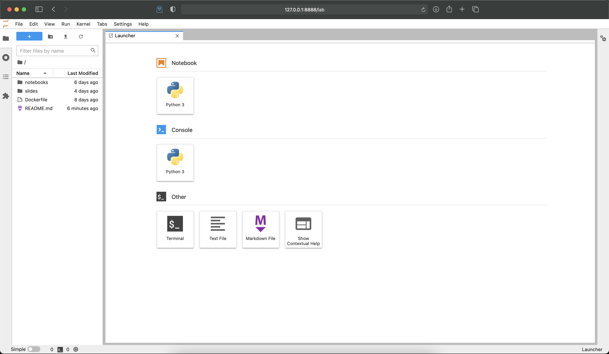

# Spark, Ray, and Python for Scalable Data Science

[](https://mybinder.org/v2/gh/psychothan/scaling-data-science/HEAD)
[](https://twitter.com/psychothan)
[](https://www.youtube.com/channel/UCi0Hd3U6xb4V0ApUhAIfu9Q)

> 7.5 hours of video instruction and code-along sessions help you scale up your data science projects using Spark, Ray, and Python.

## Overview

Machine learning is moving from futuristic AI projects to data analysis on your desk. You need to go beyond following along in discussions to coding machine learning tasks. Spark, Ray, and Python for Scalable Data Science LiveLessons show you how to scale machine learning and artificial intelligence projects using Python, Spark, and Ray.

## Materials

The code, slides, and exercises in this repository are (and will always be) freely available. The corresponding videos can be purchased on:

- [InformIT]([http://jonathans.estate/scaling-ds-videos](https://www.informit.com/store/spark-ray-and-python-for-scalable-data-science-video-9780136805946)) (individual purchase)
- [O'Reilly Learning](https://learning.oreilly.com/videos/spark-ray-and/9780136805922/) (subscription)

> If you find any errors in the code or materials, please open a Github issue in this repository or send an email to inquiries@jonathan.industries

## Skill Level

Beginner to Intermediate

## Learn How To

- Use Python for distributed computing
- Scale data processing with Spark
- Conduct exploratory data analysis with PySpark
- Utilize parallel computing with Ray
- Scale machine learning and artificial intelligence applications with Ray

## Who Should Take This Course

This course is a good fit for anyone who needs to improve their fundamental understanding of scalable data processing with Python for use in machine learning or artificial intelligence applications.

## Prerequisites

- A basic understanding of programming in Python (variables, basic control flow, simple scripts).
- Familiarity with the vocabulary of data processing at scale, machine learning (dataset, training set, test set, model), and AI helpful but not required.

## Getting Started

To run locally in a docker container 👇

```
make jupyter
```

or

```
docker run -p 8888:8888 -p 8265:8265 -p 8000:8000 -p 8089:8089 -v $(pwd):/home/jovyan/ --pull 'always' psychothan/scaling-data-science
```

Then open a web browser to the URL it spits out (the Jupyter server in the container uses [token authentication](https://jupyter-notebook.readthedocs.io/en/stable/security.html))




## Lesson Descriptions

### Lesson 1: Introduction to Distributed Computing in Python

Lesson 1 starts with an introduction to the data science process and workflow. It then turns to a bit of history on why frameworks like Spark and Ray are necessary. Next comes a short primer on distributed systems theory. Python-based distributed computing frameworks come up next. Finally, Jonathan begins to explain the Spark ecosystem as well as how Spark compares to Ray.

### Lesson 2: Scaling Data Processing with Spark

Lesson 2 goes into detail on the Spark framework beginning with a “Hello World” example of programming with Spark. Then Jonathan turns to the Spark APIs. You get some experience with one of Spark’s primary data structures, the resilient distributed dataset (RDD). Next is key-value pairs and how Spark does operations on them similar to MapReduce. The lesson finishes up with a bit of Spark internals and the overall Spark application lifecycle.

### Lesson 3: Exploratory Data Analysis with PySpark

In Lesson 3, Jonathan continues using Spark but now in the context of a larger data science workflow centered around natural language processing (NLP). He starts off with a general introduction to exploratory data analysis (EDA), followed by a quick tour of Jupyter notebooks. Next he discusses how to do EDA with Spark at scale, and then he shows you how to create statistics and data visualizations to summarize data sets. Finally, he tackles the NLP example, showing you how to transform a large corpus of text into numerical representation suitable for machine learning.

### Lesson 4: Parallel Computing with Ray

Lesson 4 introduces the Ray programming API, with Jonathan comparing the similarities and differences between the Ray and Spark APIs. You learn how you can distribute functions with Ray, as well as how you can perform operations with distributed classes or objects with Ray actors. Finally, Jonathan finishes up with a large scale simulation to highlight the strengths of the Ray framework.

### Lesson 5: Scaling AI Applications with Ray

Lesson 5 discusses how Ray enables you to scale up machine learning and artificial intelligence applications with Python. The lesson starts with the general model training and evaluation process in Python. Then it turns to how Ray enables you to scale both the evaluation and tuning of our models. You see how Ray makes possible very efficient hyperparameter tuning. You also see how, once you have a trained model, Ray can serve predictions from your machine learning model. Finally, the lesson finishes with an introduction to how Ray can enable you to both deploy machine learning models to production and monitor them once they are there.

## LICENSE

<p xmlns:cc="http://creativecommons.org/ns#" >This work by <a rel="cc:attributionURL dct:creator" property="cc:attributionName" href="https://jonathanjonathanjonathan.com">Jonathan Dinu</a> is licensed under <a href="http://creativecommons.org/licenses/by/4.0/?ref=chooser-v1" target="_blank" rel="license noopener noreferrer" style="display:inline-block;">CC BY 4.0</a></p>

### You are free to:

- **Share** — copy and redistribute the material in any medium or format
- **Adapt** — remix, transform, and build upon the material
  for any purpose, even commercially.

_The licensor cannot revoke these freedoms as long as you follow the license terms._

### Under the following terms:

- **Attribution** — You must give appropriate credit, provide a link to the license, and indicate if changes were made. You may do so in any reasonable manner, but not in any way that suggests the licensor endorses you or your use.
- **No additional restrictions** — You may not apply legal terms or technological measures that legally restrict others from doing anything the license permits.

### Notices:

You do not have to comply with the license for elements of the material in the public domain or where your use is permitted by an applicable exception or limitation.

No warranties are given. The license may not give you all of the permissions necessary for your intended use. For example, other rights such as publicity, privacy, or moral rights may limit how you use the material.
